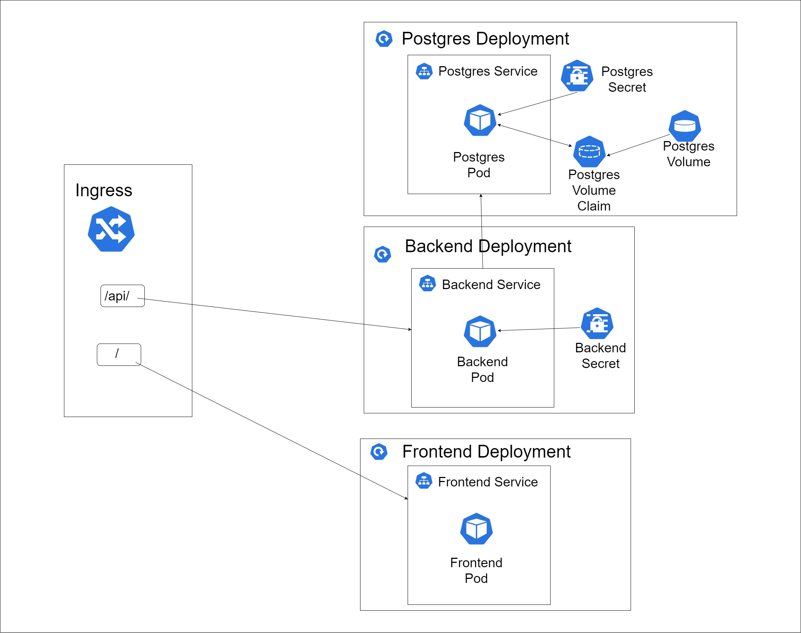

# QlikK8S

Assumption is that the user is equipped with k8s cluster
You can try this setup on dev machine with `minikube`

Run following commands in terminal

```bash
git clone https://github.com/pranav93/Qlik_Kubernetes.git
cd Qlik_Kubernetes
```

To deploy `postgres`, run

```bash
kubectl -f apply postgres/postgres-db-pv.yaml
kubectl -f apply postgres/postgres-db-pvc.yaml
kubectl -f apply postgres/postgres-secret.yaml
kubectl -f apply postgres/postgres-db-deployment.yaml
kubectl -f apply postgres/postgres-db-service.yaml
```

To deploy `backend-app`, run

```bash
kubectl -f apply backend-app/backend-app-secret.yaml
kubectl -f apply backend-app/backend-app-deployment.yaml
kubectl -f apply backend-app/backend-app-service-cip.yaml
```

To deploy `frontend-app`, run

```bash
kubectl -f apply frontend-app/frontend-app-deployment.yaml
kubectl -f apply frontend-app/frontend-app-service.yaml
```

To configure `ingress`, run

```bash
kubectl -f apply ingress.yaml
```

In case apiVersion `networking.k8s.io/v1` is not supported, use `ingress-beta.yaml` instead.
Run,

```bash
kubectl get ing ingress-service
```

That will output the ip address.
In case you are using `minikube`, just open that ip in browser, and site will be served


